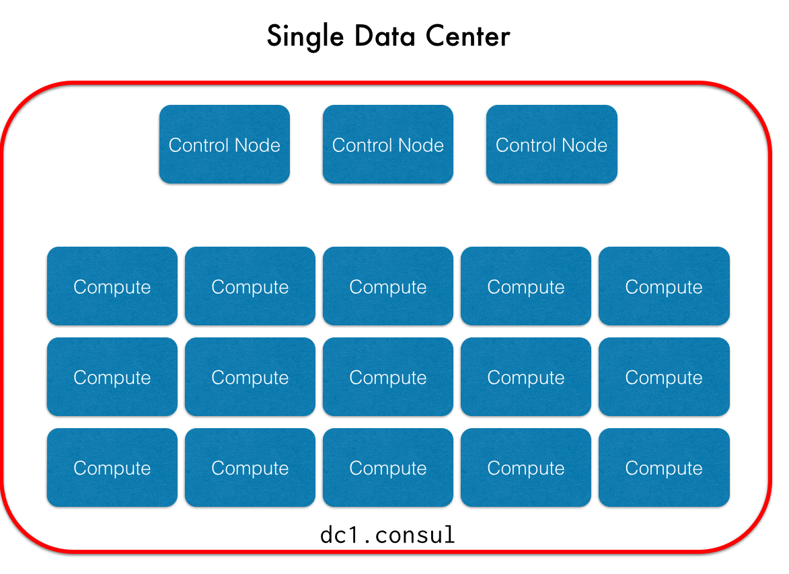
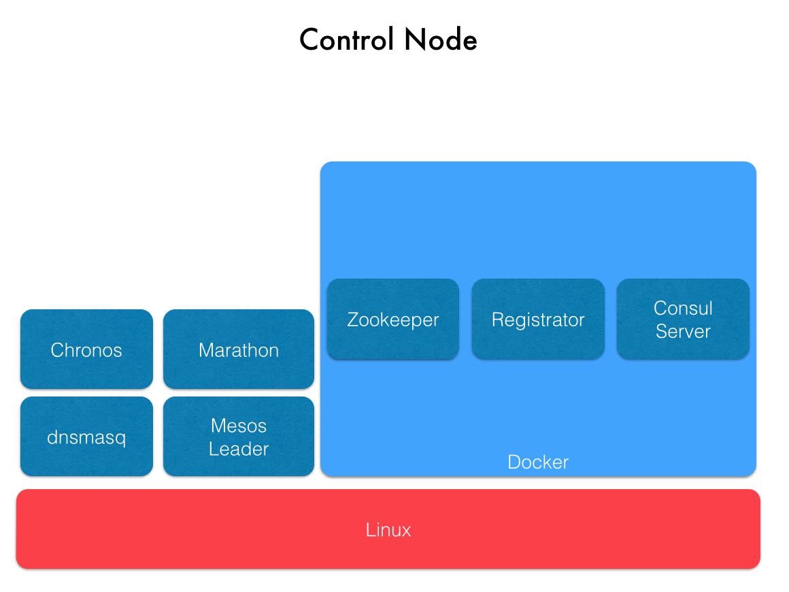
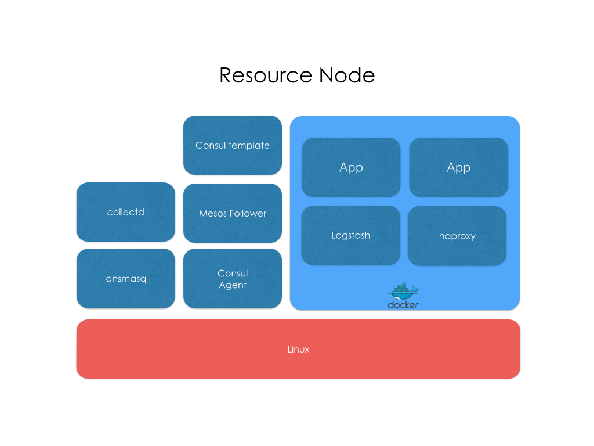
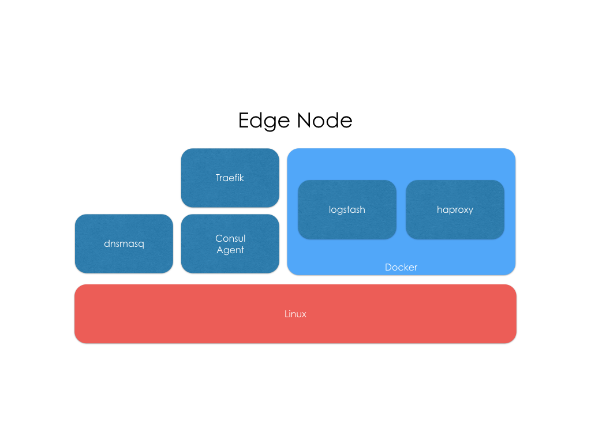

# Overview

[](https://gitter.im/CiscoCloud/mantl?utm_source=badge&utm_medium=badge&utm_campaign=pr-badge&utm_content=badge)
[](https://waffle.io/CiscoCloud/microservices-infrastructure)
[](https://travis-ci.org/CiscoCloud/mantl)


Mantl is a modern, batteries included platform for rapidly deploying globally
distributed services

<!-- markdown-toc start - Don't edit this section. Run M-x markdown-toc/generate-toc again -->
**Table of Contents**

- [Overview](#overview)
    - [Features](#features)
        - [Core Components](#core-components)
        - [Addons](#addons)
        - [Goals](#Goals)
        - [Architecture](#architecture)
        - [Control Nodes](#control-nodes)
        - [Resource Nodes](#resource-nodes)
    - [Getting Started](#getting-started)
        - [Software Requirements](#software-requirements)
        - [Deploying on multiple servers](#deploying-on-multiple-servers)
    - [Documentation](#documentation)
    - [Roadmap](#roadmap)
        - [Core Components and Features](#core-components-and-features)
        - [Mesos Frameworks](#mesos-frameworks)
        - [Security](#security)
        - [Operations](#operations)
        - [Platform Support](#platform-support)
    - [Development](#development)
    - [License](#license)

<!-- markdown-toc end -->

## Features

### Core Components
* [Consul](http://consul.io) for service discovery
* [Vault](http://vaultproject.io) for managing secrets
* [Mesos](http://mesos.apache.org) cluster manager for efficient resource
  isolation and sharing across distributed services
* [Marathon](https://mesosphere.github.io/marathon) for cluster management of
  long running containerized services
* [Terraform](https://terraform.io) deployment to multiple cloud providers
* [Docker](http://docker.io) container runtime
* [Traefik](https://traefik.github.io/) for proxying external traffic
* [mesos-consul](https://github.com/CiscoCloud/mesos-consul) populating Consul
  service discovery with Mesos tasks
* [Mantl API](https://github.com/CiscoCloud/mantl-api) easily install supported
  Mesos frameworks on Mantl
* [Mantl UI](https://github.com/CiscoCloud/nginx-mantlui) a beautiful
  administrative interface to Mantl

### Addons
* [ELK Stack](https://www.elastic.co/webinars/introduction-elk-stack) for log
  collection and analysis
     -  [Logstash](https://github.com/elastic/logstash) for log forwarding
* [GlusterFS](http://www.gluster.org/) for container volume storage
* [etcd](https://github.com/coreos/etcd) distributed key-value store for Calico
* [Calico](http://www.projectcalico.org) a new kind of virtual network
* [collectd](https://collectd.org/) for metrics collection
* [Chronos](https://mesos.github.io/chronos/) a distributed task scheduler
* [Kong](http://getkong.org) for managing APIs

See the `addons/` directory for the most up-to-date information.

### Goals
* Security
* High availability
* Rapid immutable deployment (with Terraform + Packer)

### Architecture

The base platform contains control nodes that manage the cluster and any number
of resource nodes. Containers automatically register themselves into DNS so
that other services can locate them.



### Control Nodes

The control nodes manage a single datacenter.  Each control node runs Consul
for service discovery, Mesos leaders for resource scheduling and Mesos
frameworks like Marathon.

In general, it's best to provision an odd number (at least 3 or 5) of control
nodes to achieve higher availability of services. The Consul Ansible role will
automatically bootstrap and join multiple Consul nodes. The Mesos role will
provision highly-availabile Mesos and ZooKeeper environments when more than one
node is provisioned.



### Resource Nodes

Resource nodes launch containers and other Mesos-based workloads.



### Edge Nodes

Edge nodes are responsible for proxying external traffic into services running
in the cluster.



## Getting Started

All development is done on the `master` branch. Tested, stable versions are
identified via git tags. To get started, you can clone or fork this repo:

```
git clone https://github.com/CiscoCloud/mantl.git

```

To use a stable version, use `git tag` to list the stable versions:

```
git tag
0.1.0
0.2.0
...
1.0.2


git checkout 1.0.2
```

A Vagrantfile is provided that provisions everything on a few VMs. To run,
first ensure that your system has at least 2GB of RAM free, then just:

```
vagrant up
```

Note:
* There is no support for Windows at this time, however support is planned.
* Use the latest version of Vagrant for best results. Version 1.8 is required.
* There is no support for the VMware Fusion Vagrant provider; hence your
  provider is set to Virtualbox in your Vagrantfile.

### Software Requirements

The only requirements for running Mantl are working installations of Terraform
and Ansible (or Vagrant, if you're deploying to VMs). See the "Development"
sections for requirements for developing Mantl.

### Deploying on multiple servers

Please refer to the [Getting Started
Guide](http://docs.mantl.io/en/latest/getting_started/index.html), which covers
cloud deployments.

## Documentation

All documentation is located at
[http://docs.mantl.io](http://docs.mantl.io/en/latest).

To build the documentation locally, run:

```
sudo pip install -r requirements.txt
cd docs
make html
```

## Roadmap

### Mesos Frameworks

- [x] Marathon
- [ ] Kubernetes
- [x] Kafka
- [ ] Riak
- [x] Cassandra
- [x] Elasticsearch
- [x] HDFS
- [ ] Spark
- [ ] Storm
- [x] Chronos
- [x] MemSQL

Note: The most up-to-date list of Mesos frameworks that are known to work with
Mantl is always in the [mantl-universe
repo](https://github.com/CiscoCloud/mantl-universe).

### Security

- [x] Manage Linux user accounts
- [x] Authentication and authorization for Consul
- [x] Authentication and authorization for Mesos
- [x] Authentication and authorization for Marathon
- [x] Application load balancer (based on [Traefik](https://traefik.github.io/))
- [x] Application dynamic firewalls (using consul template)

### Operations

- [x] Logging (with the ELK stack)
- [x] Metrics (with the collectd addon)
- [ ] In-service upgrade with rollback
- [ ] Autoscaling of worker nodes
- [ ] Self maintaining system (log rotation, etc)
- [ ] Self healing system (automatic failed instance replacement, etc)

### Platform Support

- [x] Vagrant (Mac OSX + VirtualBox)
- [x] Vagrant (Linux + VirtualBox)
- [ ] Vagrant (Windows + VirtualBox)
- [x] OpenStack
- [x] Cisco Cloud Services
- [x] Cisco MetaCloud
- [ ] Cisco Unified Computing System
- [x] Amazon Web Services
- [ ] Microsoft Azure
- [x] Google Compute Engine
- [ ] VMware vSphere
- [ ] Apache CloudStack
- [x] Digital Ocean

Please see [milestones](https://github.com/CiscoCloud/mantl/milestones) for
more details on the roadmap.

## Development

If you're interested in contributing to the project, install
[Terraform](https://www.terraform.io/downloads.html) and the Python modules
listed in `requirements.txt` and follow the Getting Started instructions. To
build the docs, enter the `docs` directory and run `make html`. The docs will
be output to `_build/html`.

Good issues to start with are marked with the [low hanging
fruit](https://github.com/CiscoCloud/mantl/issues?q=is%3Aopen+is%3Aissue+label%3A%22low+hanging+fruit%22)
tag.

## Getting Support

If you encounter any issues, please open a [Github
Issue](https://github.com/CiscoCloud/mantl) against the project. We review
issues daily.

We also have a [gitter chat room](https://gitter.im/CiscoCloud/mantl). Drop by
and ask any questions you might have. We'd be happy to walk you through your
first deployment.

[Cisco Intercloud Services](https://developer.cisco.com/cloud) provides support
for OpenStack based deployments of Mantl.

## License

Copyright © 2015 Cisco Systems, Inc.

Licensed under the [Apache License, Version
2.0](http://www.apache.org/licenses/LICENSE-2.0) (the "License").

Unless required by applicable law or agreed to in writing, software distributed
under the License is distributed on an "AS IS" BASIS, WITHOUT WARRANTIES OR
CONDITIONS OF ANY KIND, either express or implied. See the License for the
specific language governing permissions and limitations under the License.
