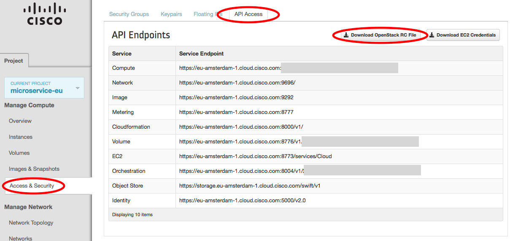

OpenStack
=========

Mantl uses Terraform to provision hosts in OpenStack. You
can `download Terraform from terraform.io
<http://www.terraform.io/downloads.html>`_.

This project provides a number of playbooks designed for doing host maintenance
tasks on OpenStack hosts. You can find them in ``playbooks/`` in the main
project directory.

Configuring OpenStack authentication
------------------------------------

Before we can build any servers using Terraform and Ansible, we need to
configure authentication. We'll be filling in the authentication variables for
the template located at ``terraform/openstack-modules.sample.tf``. It looks
like this:

.. this is highlighted as javascript for convenience, but obviously that's not
   the *real* language.

.. literalinclude:: ../../terraform/openstack-modules.sample.tf
   :language: javascript

Copy that file in it's entirety to the root of the project to start
customization. NOTE: All configuration entries needs to be completed.
In the next sections, we'll explain how to obtain these settings.

You can also use this file as a base for further customization. For example, you
can change the names of the modules to be specific to your environment. While we
will explore the authentication variables in the next sections, you will need to
provide the ``region``, ``flavor_name``, and other such variables yourself. You
can get these variables from the OpenStack command line tools. For example:

- ``glance image-list`` for ``image_name``
- ``keystone tenant-list`` for ``tenant_id`` and ``tenant_name``
- ``nova flavor-list`` for ``control_flavor_name`` and ``worker_flavor_name``

Or use the appropriate OpenStack commands such as ``openstack project list`` or
the commands below.

- ``openstack image list`` for ``image_name``
- ``openstack network list`` for ``net_id``
- ``openstack flavor list`` for ``control_flavor_name / worker_flavor_name``

Generate SSH keys
^^^^^^^^^^^^^^^^^

If you do not have ssh keys already, generate a new pair for use with the
project. You need to add the path to this key (public_key) to the openstack.tf
file.

.. code-block:: shell

  ssh-keygen -t rsa -f /path/to/project/sshkey -C "sshkey"

Getting OpenStack tenant settings
^^^^^^^^^^^^^^^^^^^^^^^^^^^^^^^^^

``auth_url``, ``tenant_name``, and ``tenant_id`` are unique for each OpenStack
datacenter. You can get these from the OpenStack web console:

1. Log Into the OpenStack web console and in the Manage Compute section, select
   "Access & Security".
2. Select the "API Access" tab.
3. Click on the "Download the OpenStack RC File" button. We'll use this file to
   set up authentication.
4. Download the RC file for each Data Center you want to provision servers in.
   You may have to log into different OpenStack web consoles.

Open the file that you just downloaded. We are interested in three of the
environment variables that are exported:

.. code-block:: shell

  export OS_AUTH_URL=https://my.openstack.com:5000/v2.0
  export OS_TENANT_ID=my-long-unique-id
  export OS_TENANT_NAME="my-project"

Update your Terraform file with these values for the appropriate fields, and
save the downloaded file for using the maintenance playbooks (you'll just need
to source the environment variables into your shell.)

OpenStack Security Group
^^^^^^^^^^^^^^^^^^^^^^^^

In order for terraform to apply correctly, you need to create a security group
in openstack for Mantl.

You can either login to the Web UI to perform this task or use the openstack
commmand line interface as below.

.. code-block:: shell

  openstack security group create <group_name>

Once your group is created, ensure you update the openstack.tf file accordingly.

OpenStack Username/Password
^^^^^^^^^^^^^^^^^^^^^^^^^^^

The playbooks get Username/Password information via environment variables:

.. envvar:: OS_USERNAME

   Your OpenStack username

.. envvar:: OS_PASSWORD

   Your OpenStack password

Before running terraform or any playbooks, run the following command to to pull
in your username and password for Ansible to use, changing the file name and
location to the location of your OpenStack RC file:

.. code-block:: shell

  source ~/Downloads/my-project.rc

.. note:: The default OpenStack RC file will prompt for your password in order
          to set OS_PASSWORD.

Once you're all set up there, run ``terraform get`` to prepare Terraform to
provision your cluster, ``terraform plan`` to see what will be created, and
``terraform apply`` to provision the cluster. Afterwards, you can use the
instructions in :doc:`getting started <index>` to install
Mantl on your new cluster.
