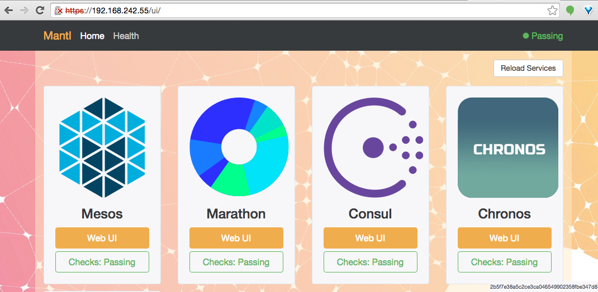
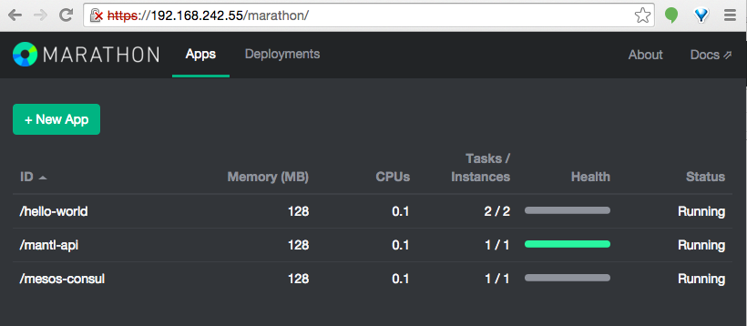
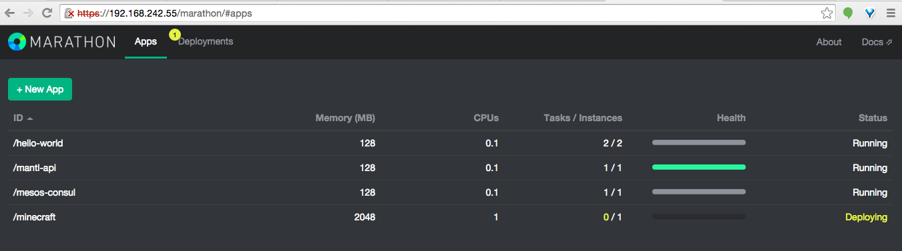
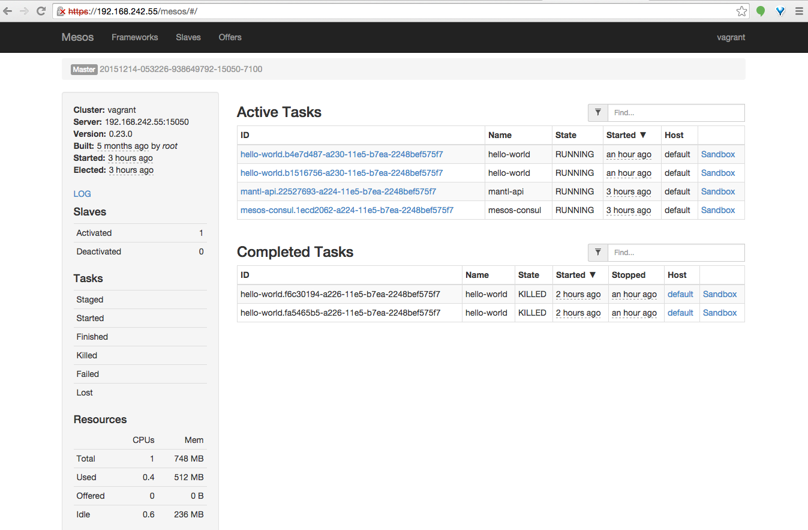

# Examples

The examples in this directory are applications that can be run on your Mantl
cluster.

In each example directory is a README.md that provides the short and sweet
instructions. Below we go through the examples in more detail and provide more
of an introduction to what is going on.

## Getting a Cluster Up

#### Vagrant

Getting the vagrant cluster up and running on your computer is the easiest way
to get a cluster going for the examples. To do this, see Getting Started in the
[README.md](../README.md) at root of this project.

If you have not done so yet, go ahead get vagrant up now. It will take a couple
of minutes and you can read on while you wait.

To run these examples you will need to know:

1. The url for marathon:
Marathon runs on port 8080 or at the /marathon endpoint, and if you look in
[the Vagrant README](../vagrant/README.rst), you will see that your control node
will by default have the IP "192.168.100.101" and your worker will have the IP
"192.168.100.201".

2. User name and password for marathon:
After you have run`./security-setup` in the root of this project, there will be
a file `security.yml`.  Inside this file is the line:

        marathon_http_credentials: admin:hardpass

During your run of `./security-setup` you will be asked to set an admin
password:

    $ ./security-setup
    ============= Certificates =============
    ----> certificate authority
    created serial
    created index
    generated root CA
    ================ Nginx =================
    ----> SSL certificate
    generated nginx key
    generated nginx CSR
    generated nginx certificate
    nginx certificate is valid
    ----> admin password
    Admin Password:

which is the password used for Marathon.

### Other Clusters

If you want to dive right into a cloud cluster go through
[Getting Started](https://docs.mantl.io/en/latest/getting_started/index.html)
at the Documentation site. You can then change the relevant parts of the
following instructions.

### Submitting Applications to The Marathon API

While in a terminal, in this examples directory enter:

    $ curl -k -X POST -H "Content-Type: application/json" -u "admin:hardpass" -d@"hello-world/hello-world.json" "https://192.168.100.101/marathon/v2/apps"

You should get back something like:

    {"id":"/hello-world","cmd":null,"args":null,"user":null,"env":{},"instances":2,"cpus":0.1,"mem":128.0,"disk":0.0,"executor":"","constraints":[],"uris":[],"storeUrls":[],"ports":[0],"requirePorts":false,"backoffFactor":1.15,"container":{"type":"DOCKER","volumes":[],"docker":{"image":"keithchambers/docker-hello-world","network":"BRIDGE","portMappings":[{"containerPort":80,"hostPort":0,"servicePort":0,"protocol":"tcp"}],"privileged":false,"parameters":[],"forcePullImage":false}},"healthChecks":[],"dependencies":[],"upgradeStrategy":{"minimumHealthCapacity":1.0,"maximumOverCapacity":1.0},"labels":{},"acceptedResourceRoles":null,"version":"2015-12-14T05:53:13.140Z","deployments":[{"id":"1b534972-53ee-4198-8860-ea0c48c3d7e9"}],"tasks":[],"tasksStaged":0,"tasksRunning":0,"tasksHealthy":0,"tasksUnhealthy":0,"backoffSeconds":1,"maxLaunchDelaySeconds":3600}

If not perhaps you messed up an option. Here is what they do:

Option -k turns off ssl certificate verification. Mantl, by default, uses
self-signed certificates. If you forgot the -k you get this message:

    $ curl -X POST -H "Content-Type: application/json" -u "admin:hardpass" -d@"hello-world/hello-world.json" "https://192.168.100.101/marathon/v2/apps"
    curl: (60) SSL certificate problem: Invalid certificate chain
    More details here: http://curl.haxx.se/docs/sslcerts.html

    curl performs SSL certificate verification by default, using a "bundle"
     of Certificate Authority (CA) public keys (CA certs). If the default
     bundle file isn't adequate, you can specify an alternate file
     using the --cacert option.
    If this HTTPS server uses a certificate signed by a CA represented in
     the bundle, the certificate verification probably failed due to a
     problem with the certificate (it might be expired, or the name might
     not match the domain name in the URL).
    If you'd like to turn off curl's verification of the certificate, use
     the -k (or --insecure) option.

Option -X allows you to specify a HTTP verb other than the default GET. In this
case we want to POST.  The following error happens if we forget the -X or the
`-d@"file.json"`, or possibly because you are submiting the command from the
wrong directory (i.e. you should change the path to `file.json`).

    $ curl -k -H "Content-Type: application/json" -u "admin:hardpass" -d@"hello-world/hello-world.json" "https://192.168.100.101/marathon/v2/apps"
    <html>
    <head>
    <meta http-equiv="Content-Type" content="text/html;charset=ISO-8859-1"/>
    <title>Error 400 Bad Content-Type header value: 'application/json '</title>
    </head>
    <body>
    <h2>HTTP ERROR: 400</h2>
    <p>Problem accessing /v2/apps. Reason:
    <pre>    Bad Content-Type header value: 'application/json '</pre></p>
    <hr /><i><small>Powered by Jetty://</small></i>

Option -H specifies a header argument. In this case we want to set the content type to json.  If you leave this off
you will get:

    $ curl -k -X POST -u "admin:hardpass" -d@"hello-world/hello-world.json" "https://192.168.100.101/marathon/v2/apps"
    curl: (6) Could not resolve host:  
    {"message":"Unsupported Media Type"}

### The Marathon API and the Application JSON

In the curl call we went to the following path `/v2/apps`. This is the API call
for creating and starting new apps.
See [Marathon REST API](https://mesosphere.github.io/marathon/docs/rest-api.html) for further calls. Two handy ones for our purposes are:

##### Current Status

From this REST API, get current status with:

    curl -k -u "admin:hardpass" "https://192.168.100.101/marathon/v2/apps/hello-world"

which returns a big blob of json.  If you want this cleaned up a bit try adding `| python -m json.tool` :

    curl -k -u "admin:hardpass" "https://192.168.100.101/marathon/v2/apps/hello-world" | python -m json.tool

That should give you a nicely formated output of the current state of the app.

Notice that we didn't need headers `-H` and the http verb was the default GET,
so we didn't need `-X`. We still needed the -k to get around our self signed ssl
certificate.

##### Delete App

From this REST API, the call to destroy the application is:

    curl -k -X DELETE -u "admin:hardpass" "https://192.168.100.101/marathon/v2/apps/hello-world"

which is the same as the current status path but with the HTTP DELETE verb
instead of the default GET. If the call is successful you will get something
like:

    {"version":"2015-12-14T06:44:37.378Z","deploymentId":"e7680e8e-d073-4c57-9f64-e73d8b634398"}

Now you can check the status again, as per the previous section. It should give
you `{"message":"App '/hello-world' does not exist"}`.


## Where is my Application?

In a browser, go to the IP of one of your vagrant control nodes. (Some browsers,
like Firefox, will outright reject the SSL certificate, so you may need to use
another for this step). This will be the value in your Vagrantfile as described
earlier.



Choose the Marathon "Web UI" button and you should see something like this:



Click on your application, hello-world (if its not there, you probably deleted
it while working through the steps above, but you can just start it again.)
and you should see:


You'll notice that there are two instances. Each one has a line under it in
gray `default:<####>` where <####> is some port number. In the picture above,
these are ports 9061 and 25312.

If there aren't two instances, see step 2 under "Destroy the Vagrant Cluster and
Build on for Minecraft" to add more memory to your VMs.

There are two instances here becasue the hello-world.json file you submitted
specifies for two instances to be created. This is two seperate hello-world
applications, possibly running on different hosts.

If you click on the `worker-001:9061` it will open your browser to
`worker-001:9061` and get a `webpage is not avaiable` error. This is because you
don't have `worker-001` mapped to the Vagrant VM's IP address in your hosts
file. Rather than mess with that, you can just take the port information and add
it to the IP of where we know the Vagrant machine is located. Open the browser
to `<VM-IP>:9061` and you'll see:

 

Note that it has the container number in it. If you go back and look at
Marathon, you can navigate to the other port and find the other container.
If you look into the json file for [hello world](hello-world/hello-world.json)
you will see that you are submiting a call to create two instances of a docker
image: `"image": "keithchambers/docker-hello-world"`. You can see the the [php code running in this container](https://github.com/keithchambers/docker-hello-world/blob/master/index.php).

## Destroy the Vagrant Cluster and Build on for Minecraft

If you want to use the vagrant cluster for the Minecraft example you have to
make a worker VM with more resources. Minecraft requires 2GB of RAM free for
good performance.

Easy enough! If you have the resources on your computer, you can

1. Destroy your vagrant server. Go to the project root and type:

        vagrant destroy

2. Create a `vagrant-config.yml` file in the root directory, and add

```
---
worker_memory: 3072
```

as documented in the [Vagrant README](../vagrant/README.rst).

3. Run

        vagrant up

Once your cluster comes up, you can post the application to Marathon like in the
previous example, but with the data option changed to
`-d@"minecraft/minecraft.json"`. If your VMs don't have enough resources, the
app will be stuck "deploying" in the Marathon UI:



Notice the /minecraft app has a Memory(MB) value of 2048, which indicates that
it is requesting 2GB of RAM.  This value is from the
[json file you submitted](minecraft/minecraft.json).

To investigate, go back to the Mantl UI and then navigate to the Mesos "Web UI".



You might see that no Minecraft task is running. If you look down the side
you'll see that the "total offered" is 0 and there is some quantity of memory
idle. The request on the Marathon page above is for 2048 MB, there might not be
enough, so Marathon will wait until the requested resources are available.

With the right amount of memory and the Minecraft successfully running, you can
can check the status of the application as described above using the Marathon
API, and near the bottom of the listing there should be a list of tasks. It
should look like this:

    "tasks": [
                {
                    "appId": "/minecraft",
                    "healthCheckResults": [
                        {
                            "alive": true,
                            "consecutiveFailures": 0,
                            "firstSuccess": "2015-12-14T08:25:32.032Z",
                            "lastFailure": null,
                            "lastSuccess": "2015-12-14T08:25:32.032Z",
                            "taskId": "minecraft.1c820b04-a23c-11e5-bc5d-5e55552100a7"
                        }
                    ],
                    "host": "default",
                    "id": "minecraft.1c820b04-a23c-11e5-bc5d-5e55552100a7",
                    "ports": [
                        9199
                    ],
                    "stagedAt": "2015-12-14T08:24:36.469Z",
                    "startedAt": "2015-12-14T08:25:22.424Z",
                    "version": "2015-12-14T08:24:31.818Z"
                }
            ],

In this example, the task with appId "/minecraft"  on host "default" is
listening on port 9199. With that information, you can open your Minecraft
client and connect to `<VM-IP>:<minecraft-port>`. Happy mining!
